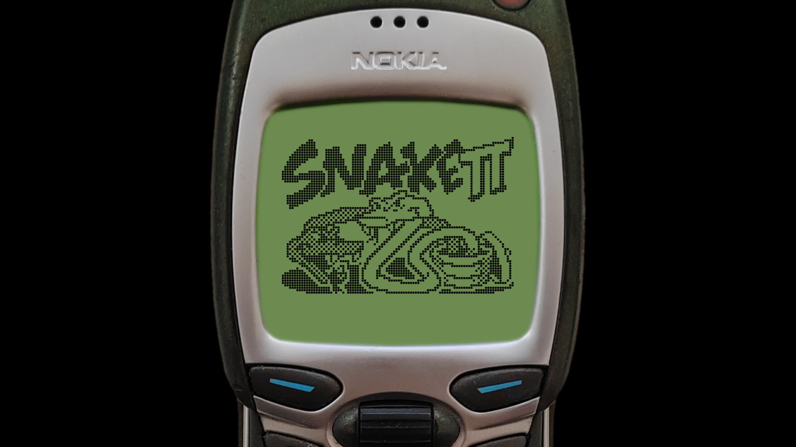
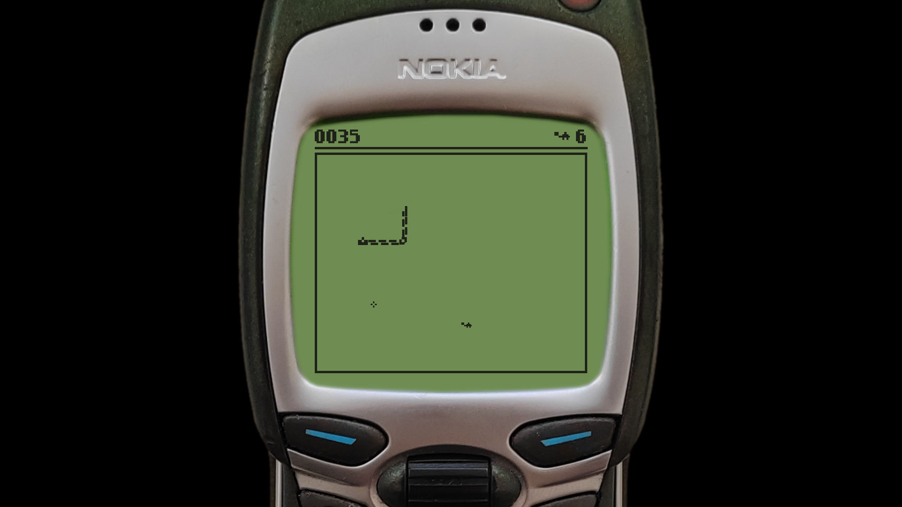
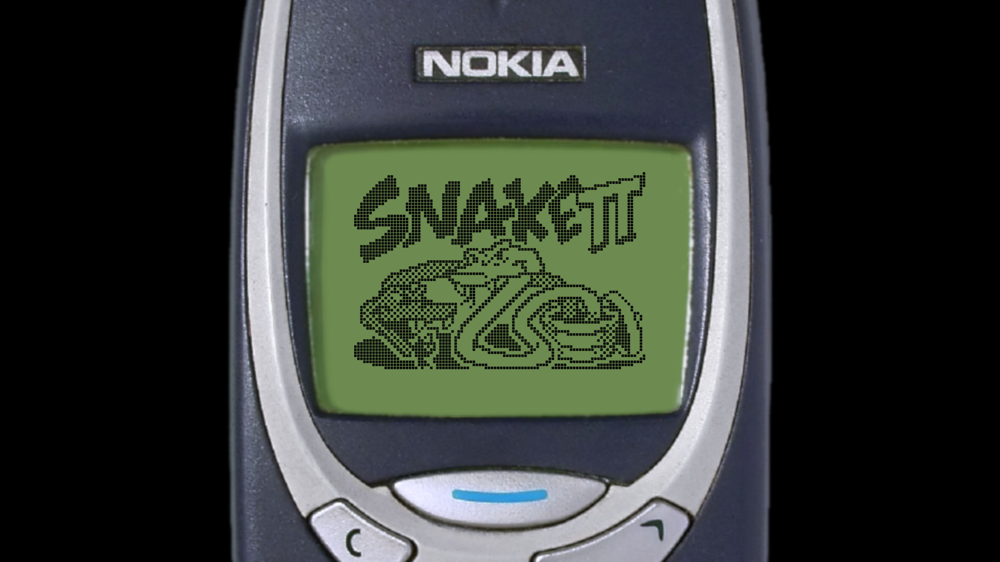
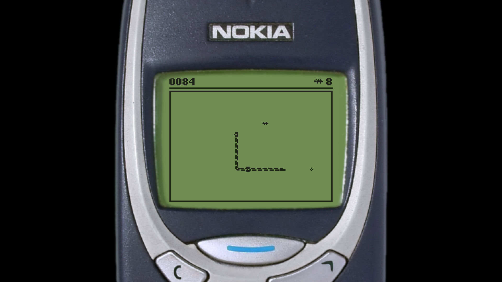
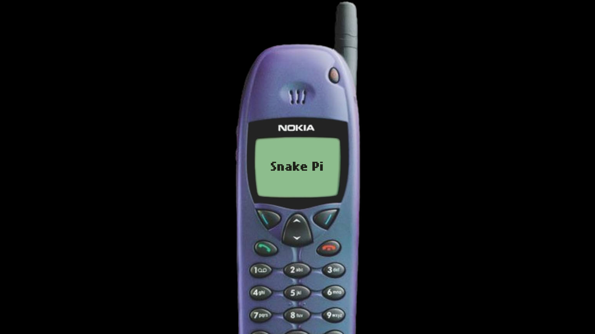
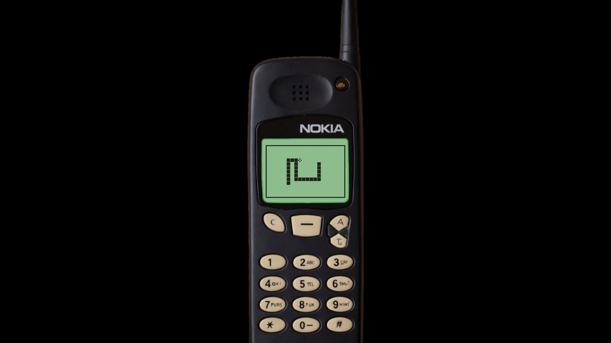
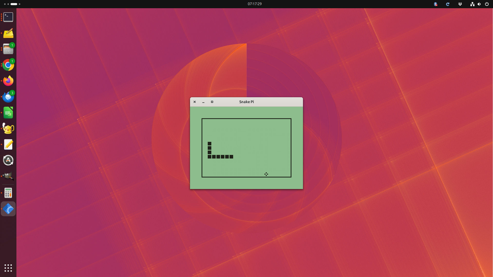
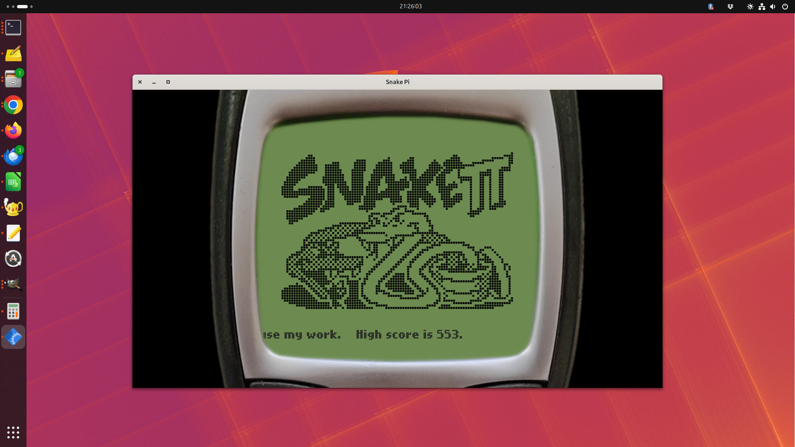
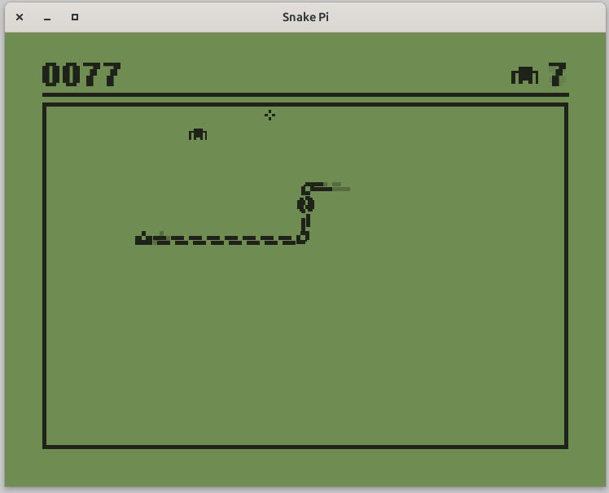

# Snake Pi

[](https://www.python.org)
[](http://www.pygame.org/news.html)
[](https://github.com/MS-potilas/snake-pi)

## About

**Snake Pi** is a modern, retro-styled clone of the classic **Nokia Snake II** game. It features nostalgic Nokia 7110 and 3310 phone overlays and joystick support. 

While specifically optimized to run on **RetroPie**, it can also be played on any standard desktop environment (Linux, macOS, Windows). 

*This project is a fork of [Sara Martínez's snake-game](https://github.com/smartido/snake-game). It includes bug fixes, gameplay improvements, optimized game logic, and overlay images.*

## Controls

You can control the snake using a keyboard or a controller/joystick:

*   **Arrow Keys:** Move up, down, left, or right
*   **Numpad (2, 4, 6, 8):** Traditional Nokia-style movement
*   **Joystick / D-Pad:** Full analog or digital controller support for RetroPie setups
*   **Esc / Q:** Quit the game

## Original Snake (not II)

Snake Pi also includes a remake of the original **Snake** game found on older phones like the Nokia 5110 and 6110. By default, this feature is hidden. You can enable it using the following command-line options:

*   `--5110`: Launches the Nokia 5110 overlay with the original Snake gameplay.
*   `--6110`: Launches the Nokia 6110 overlay with the original Snake gameplay.
*   `--old`: Launches the original Snake gameplay with a randomly chosen overlay (unless `--nocase` is specified).
*   `--oldrandom`: Includes the original Snake gameplay in the random overlay pool. There is a 20% probability of getting the original Snake layout.

See all available [Command-Line Options](#command-line-options) below.

## Screenshots

Click on any image to view it in full resolution.

<table align="center">
  <tr>
    <td align="center">
      <br><b>Title screen, Nokia 7110 overlay</b><br><tt>--7110 --fullscreen</tt></br>
      <a href="https://raw.githubusercontent.com/MS-potilas/snake-pi/master/assets/7110_title.jpg"></a>
    </td>
    <td align="center">
      <br><b>Game, Nokia 7110 overlay</b><br><tt>--7110 --fullscreen</tt></br>
      <a href="https://raw.githubusercontent.com/MS-potilas/snake-pi/master/assets/7110_game.jpg"></a>
    </td>
  </tr>
  <tr>
    <td align="center" width="50%">
      <br><b>Title screen, Nokia 3310 overlay</b><br><tt>--3310 --fullscreen</tt></br>
      <a href="https://raw.githubusercontent.com/MS-potilas/snake-pi/master/assets/3310_title.jpg"></a>
    </td>
    <td align="center" width="50%">
      <br><b>Game, Nokia 3310 overlay</b><br><tt>--3310 --fullscreen</tt></br>
      <a href="https://raw.githubusercontent.com/MS-potilas/snake-pi/master/assets/3310_game.jpg"></a>
    </td>
  </tr>
  <tr>
    <td align="center" width="50%">
      <br><b>Title screen, Nokia 6110 overlay</b><br><tt>--6110 --fullscreen</tt></br>
      <a href="https://raw.githubusercontent.com/MS-potilas/snake-pi/master/assets/6110_title.jpg"></a>
    </td>
    <td align="center" width="50%">
      <br><b>Game (original Snake), Nokia 5110 overlay</b><br><tt>--5110 --fullscreen</tt></br>
      <a href="https://raw.githubusercontent.com/MS-potilas/snake-pi/master/assets/5110_game.jpg"></a>
    </td>
  </tr>
  <tr>
    <td align="center">
      <br><b>Game (original Snake), no overlay, windowed</b><br><tt>--old --nocase --windowed</tt></br>
      <a href="https://raw.githubusercontent.com/MS-potilas/snake-pi/master/assets/old_snake_no_case_windowed.jpg"></a>
    </td>
    <td align="center">
      <br><b>Game, Nokia 7110 overlay, windowed</b><br><tt>--7110 --windowed</tt></br>
      <a href="https://raw.githubusercontent.com/MS-potilas/snake-pi/master/assets/7110_windowed.jpg"></a>
    </td>
  </tr>
  <tr>
    <td align="center">
      <br><b>Game, no overlay, windowed</b><br><tt>--nocase --windowed</tt></br>
      <a href="https://raw.githubusercontent.com/MS-potilas/snake-pi/master/assets/no_case_windowed.jpg"></a>
    </td>
  </tr>
</table>

## Retro Surprise

Once you reach 500 points and more, you may see a retro surprise.

## Installation & Running

Follow these steps to get the game running on your system.

### Prerequisites

You will need **Python** and **Pygame** installed:
* **Python** (version 3.7.3 or newer)
* **Pygame** (version 1.9.4 or newer)

On Debian-based systems (like Ubuntu or RetroPie / Raspberry Pi OS), you can install Pygame via apt:
```bash
sudo apt update
sudo apt install python3-pygame
```

### Setup

1. **Clone the repository** and navigate to the project directory:
   ```bash
   git clone https://github.com/MS-potilas/snake-pi.git
   cd snake-pi
   ```

2. **Run the game**:
   ```bash
   python3 snake.py
   ```

### Command-Line Options

| Option | Description |
| :--- | :--- |
| `--fullscreen` | Opens the game in full-screen mode (implied when run outside a windowing system). |
| `--windowed` | Opens the game in a window (implied when run under a windowing system). |
| `--7110` | Uses the Nokia 7110 overlay (Snake II). |
| `--3310` | Uses the Nokia 3310 overlay (Snake II). |
| `--6110` | Uses the Nokia 6110 overlay with original Snake gameplay (implies `--old`). |
| `--5110` | Uses the Nokia 5110 overlay with original Snake gameplay (implies `--old`). |
| `--nocase` | Runs the game in a window without any phone overlay. |
| `--old` | Opens the original Snake gameplay with a randomly chosen overlay (unless `--nocase` is used). |
| `--oldrandom` | Includes the original Snake gameplay in the random overlay selection with a 20% probability. |

### RetroPie Installation (Ports menu)

To add Snake Pi to your RetroPie **Ports** menu so it can be launched directly from EmulationStation, follow these steps:

1. **Move the project folder** to your RetroPie roms directory:
   ```bash
   mv ../snake-pi ~/RetroPie/roms/ports/
   ```

2. **Create a launch script** inside the ports directory:
   ```bash
   nano ~/RetroPie/roms/ports/Snake_Pi.sh
   ```

3. **Paste the following content** into the file (save with `Ctrl+O`, `Enter`, and exit with `Ctrl+X`):
   ```bash
   #!/bin/bash
   python3 ~/RetroPie/roms/ports/snake-pi/snake.py
   ```

4. **Make the script executable**:
   ```bash
   chmod +x ~/RetroPie/roms/ports/Snake_Pi.sh
   ```

5. **Restart EmulationStation** (via the Main Menu -> Quit -> Restart EmulationStation), and **Snake Pi** will appear under the *Ports* system!

The instructions above create a launcher for the default Snake II style game. If you wish to include the original Snake game with the Nokia 5110/6110 overlays, you can add the `--oldrandom` flag to the script. 

Alternatively, if you want a separate menu entry for the older game style, you can create a second launch script (for example, `Snake_Pi_I.sh`) and add the `--old` flag to the python command.

#### EmulationStation Gamelist Entry

Gamelist entry values for the default Snake II style game:

```xml
name:        Snake Pi
path:        ./Snake_Pi.sh
desc:        Snake Pi is a retro-style clone of the classic Snake II game included in phones such as the Nokia 7110 and Nokia 3310. Collect as much food as possible while avoiding walls and your own tail.
image:       ~/RetroPie/roms/ports/snake-pi/assets/snake_collage.jpg
genre:       Action
releasedate: 20260909T000000
developer:   MS-potilas
publisher:   Public Domain
```

**Optional descriptions depending on your setup:**

*   **For the Original Snake I launcher (`--old`):**
    > "Snake Pi is a retro-style clone of the classic Snake game included in phones such as the Nokia 6110 and Nokia 5110. Collect as much food as possible while avoiding walls and your own tail."
    > *Image path:* `~/RetroPie/roms/ports/snake-pi/assets/5110_game.jpg`

*   **For the combined launcher (`--oldrandom`):**
    > "Snake Pi is a retro-styled clone of the classic Snake and Snake II games included in old Nokia phones. Collect as much food as possible while avoiding walls and your own tail."
    > *Image path:* `~/RetroPie/roms/ports/snake-pi/assets/snake_collage.jpg`


## License

This project is licensed under the **MIT License** - see the [LICENSE](LICENSE) file for details.

*   Background framework & initial code © 2023 Sara Martínez
*   RetroPie modifications, Nokia overlays, and game logic enhancements © 2026 MS-potilas
